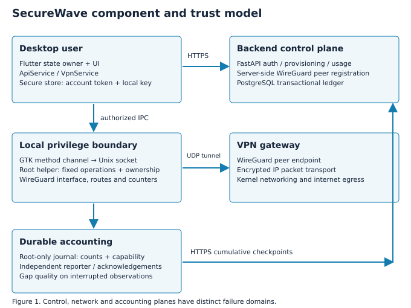

# 2. System architecture

## 2.1 Three planes

The presentation and control plane begins in `securewave_app/lib/app.dart`.
It owns authentication, connection transitions, recovery and usage polling.
Widgets in `lib/ui/` receive state and callbacks. `ApiService` performs HTTP
requests and maps endpoint-specific failures; `VpnService` orchestrates the
native tunnel contract and validates runtime evidence.

The local network plane is a Flutter Linux method channel, a GTK runner, a Unix
domain socket and the privileged helper daemon. The daemon executes approved
WireGuard operations against a fixed interface. WireGuard and the operating
system carry traffic; neither Flutter nor FastAPI encrypts each packet. The
server registers peers and provides network parameters through the backend's
WireGuard helper client.

The accounting plane spans the daemon's protected local journal, a separate
reporter process and the backend usage service. GUI exit should not discard an
already journaled checkpoint. Reporting continues independently using a
session-scoped capability. The backend serializes accepted cumulative updates
into session, event and peer records.

## 2.2 Components and responsibilities

| Component | Responsibility | Explicit boundary |
| --- | --- | --- |
| App state owner | Authentication and lifecycle transitions | Does not declare Connected from a successful config response |
| UI widgets | Render state and accessible actions | Do not provision peers or own tunnel state |
| ApiService | Auth, config and usage requests | Does not receive the client private key |
| VpnService | Native commands and verification | Requires observable tunnel evidence |
| GTK runner | Translate method calls to helper protocol | Does not accept arbitrary root shell commands |
| Helper daemon | Authorized network operations and durable samples | Fixed operations, caller identity and safe path checks |
| Usage reporter | Deliver pending journal entries and acknowledgements | Uses a per-session reporting capability |
| FastAPI routes | Validate requests, authenticate and authorize | Account-scoped resource access |
| Usage service | Serialize cumulative ledger updates | Database transaction and duplicate detection |
| PostgreSQL | Persist identities, peers, sessions and events | Production locking and crash consistency |

## 2.3 Connection data flow

The signed-in client retrieves its account identifier and reuses or creates a
WireGuard key pair in secure storage. It sends the public key to
`POST /api/vpn/config`. The backend selects an eligible active server, checks
ownership and address availability, and registers or reconciles the peer. The
response supplies the server public key, endpoint, client address, allowed
prefixes, DNS and keepalive information. It excludes a client private key.

The client combines these parameters with its local private key to form the
temporary local configuration. It creates a backend usage session, then asks
the helper to establish the interface with that session's accounting metadata.
Verification interrogates the real runtime, route and egress. Only after this
evidence passes and recording is confirmed does the state owner publish
Connected.

Application HTTPS and WireGuard UDP traffic have distinct roles. HTTPS
transports account and provisioning data. WireGuard transports tunneled IP
packets. A working API response does not prove that the UDP endpoint is reachable
or that routing changed. Conversely, an existing interface does not prove that
the authenticated account's expected peer is active.

## 2.4 Trust boundaries and secret placement

The first boundary separates the GUI user from root networking. Socket
permissions, group authorization and peer credentials constrain access. The
second separates the device from the API, where bearer authentication and
ownership checks protect provisioning and history. The third separates
untrusted reporting requests from transactional ledger mutation.

The JWT remains an account credential in the client/API relationship. The
reporting capability authorizes updates for one usage session and is stored in
the root-protected journal; it is not the account JWT. The server stores its
hash. Client private WireGuard keys remain local, while a temporary mode-0600
configuration necessarily exposes the private key to the trusted privileged
networking component. This is a narrower boundary than claiming that no
process ever accesses the key.

## 2.5 Source traceability

Review `app.dart`, `services/api_service.dart` and `services/vpn_service.dart`
first. Then follow `linux/runner/my_application.cc`,
`linux/helperd/securewave_helperd.cc` and `linux/helperd/usage_recorder.h`.
Backend behavior is concentrated in `routes/auth.py`, `routes/vpn.py`,
`routes/usage_recording.py`, `services/usage_metering_service.py` and the models directory.
The [engineering walkthrough](../portfolio/engineering-walkthrough.md) links
the corresponding files directly.
