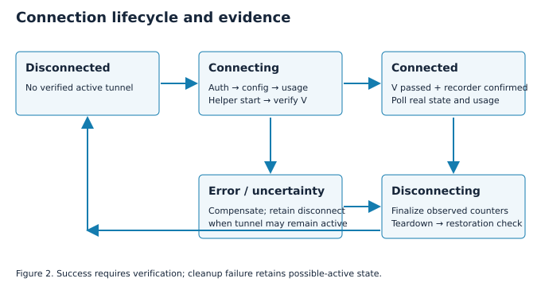

# 4. Connection lifecycle algorithms



## 4.1 State model

Let Q = {disconnected, connecting, connected, disconnecting, error}. The UI
renders q in Q, while the helper reports the observed runtime. A separate
flag records whether the tunnel may still be active after a failed operation.
This prevents an error message from implying that privileged resources were
removed. Transition controls are disabled while a lifecycle operation is busy.
The state owner in `app.dart` remains authoritative; presentation widgets only
map its values to text, controls and visual states.

The connection predicate can be expressed as:

```text
V = I ∧ P ∧ H ∧ C ∧ R ∧ E
H = (handshake > 0) ∧ (-30 ≤ now - handshake ≤ 180 seconds)
C = counters_available ∧ (rx > 0) ∧ (tx > 0)
R = route_get(1.1.1.1).device = sw-wg
E = public_ipv4_after ≠ public_ipv4_before
```

I denotes an active expected interface; P denotes the configured server public
key in its peer set. Both the runtime snapshot and a subsequent traffic-stat
query must expose nonzero counters in both directions. Acceptance independently
records both directions before and after generated traffic. The IPv4 route/egress
checks are evidence of that path, not a proof that all applications, IPv6
traffic or alternate routing tables use the tunnel.

## 4.2 Algorithm 1: connect with compensation

```text
Input: authenticated account u, current runtime, local secure store
Output: verified Connected, or Error with cleanup outcome
1  reject if another recorded tunnel already owns the interface
2  q ← connecting; unavailable counters; remember public IPv4 baseline
3  obtain account-scoped local WireGuard key pair (sk, pk)
4  params ← authenticated POST config(pk)
5  require installed helper availability and expected contract
6  s ← create usage session for the provisioned peer
7  mark tunnel as potentially active before requesting privileged creation
8  helper.connect(config(sk, params), session=s, expected_peer=params.pk)
9  require V from authoritative runtime and independent network observations
10 confirm usage recording; q ← connected; start runtime/usage polling
11 on failure: request teardown and verify disconnection
12 preserve Error and potential-active flag if cleanup cannot be verified
13 if the session never became connected: attempt failed-start finalization
```

The ordering places the accounting session before tunnel creation so that a
successful privileged start has a reporting identity. Compensation covers
failure after side effects begin. A failure to finish reporting does not erase
the requirement to remove the tunnel. The API session and local interface are
not committed atomically; orphaned failed-start sessions are a possible recovery
case if both finalization and retry mechanisms are unavailable.

## 4.3 Algorithm 2: disconnection and network restoration

```text
Input: potentially active owned tunnel, saved baseline
1  q ← disconnecting; stop GUI usage polling
2  helper finalizes measured usage and tears down the fixed interface
3  verify that the interface is absent and normal internet access is restored
4  clear saved baseline only according to the cleanup path's result
5  if verification succeeds: q ← disconnected; potential_active ← false
6  otherwise: q ← error; potential_active ← true; retain a disconnect action
```

The application's verification and the acceptance harness have different
strengths. The application checks its supported restoration contract. The
harness records before/after route tables, rules, resolver state and egress,
then compares them. A harness comparison should normalize volatile fields if
unrelated interfaces change during the experiment. Tailscale or other active
network managers can otherwise create an attribution problem.

## 4.4 Recovery on launch

Session restoration first validates the stored access token. An expired
session returns to sign-in. Runtime restoration is independent: if an interface
exists, the app requires its saved baseline, local identity, expected peer and
ownership/verification evidence. Missing or inconsistent evidence triggers
safe cleanup rather than displaying Connected from cached UI state. Another
window's tunnel cannot be silently adopted by the new process.

The daemon handles process exit independently of Flutter disposal callbacks.
Callbacks are useful for orderly closure, but SIGKILL bypasses them. The
process descriptor and journal support observed finalization when the owner
dies. Reboot differs: the previous process and interface cease to exist, and
journal recovery marks interrupted observations. A user's statement that the
VM rebooted does not replace boot time, daemon startup, route and lifecycle
evidence.

## 4.5 Observation limits

The predicate is sampled. An observed valid tunnel can fail immediately after
verification; periodic polling updates the UI but cannot make it omniscient.
The external egress probe introduces another dependency and can reject a
usable tunnel when that service is unavailable. Handshake freshness bounds
provide practical evidence rather than continuous cryptographic attestation.
These tradeoffs favor truthful observable state over an optimistic success
message after an API call.
